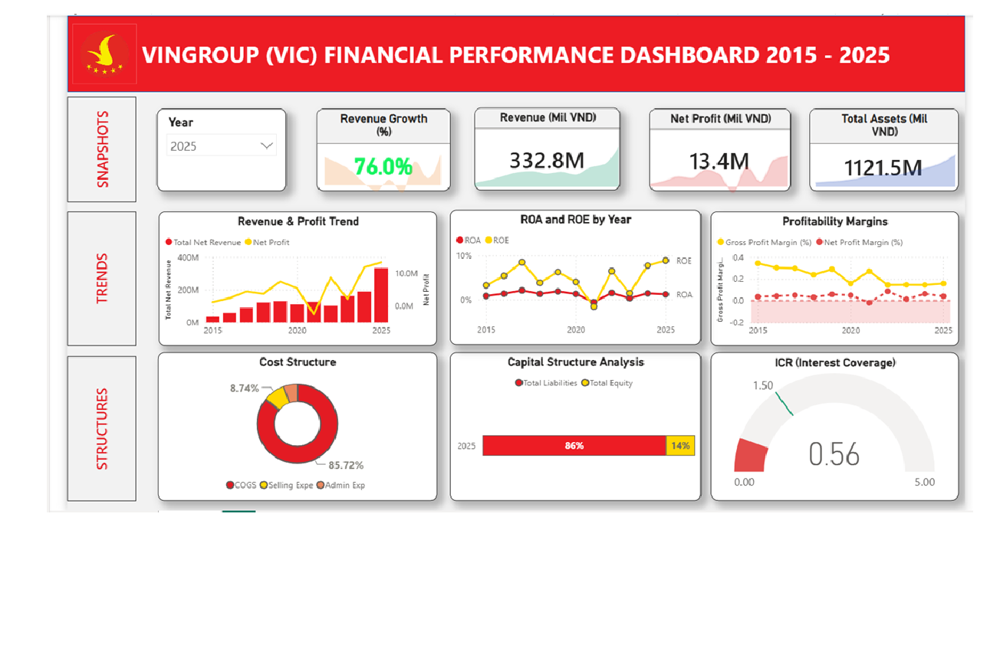

# 📊 Vingroup Financial Performance Dashboard

## Project Overview

This project analyzes Vingroup's financial performance from 2015–2025 using Power BI.

The dashboard provides insights into profitability, growth, liquidity, and solvency through interactive visualizations and KPI tracking.

---

## Objectives

- Analyze financial performance
- Compare yearly growth
- Track profitability
- Evaluate financial health

---

## Tools

- Power BI
- Power Query
- DAX
- Excel

---

## KPIs

- Revenue
- Gross Profit
- Net Profit
- ROE
- ROA
- ICR
- Profit Margin

---

## Dashboard Preview

---

## Key Insights

- Revenue increased steadily over the analysis period.
- Profitability fluctuated during market downturns.
- ROE remained strong despite increasing liabilities.
- Interest Coverage Ratio improved after debt restructuring.

---

## Author

Pham Phuoc
